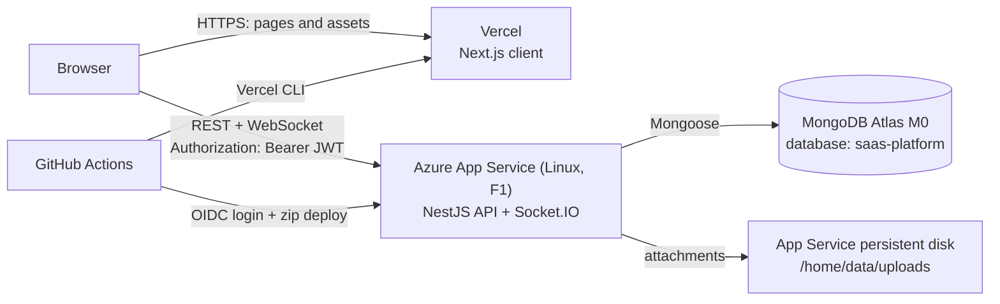
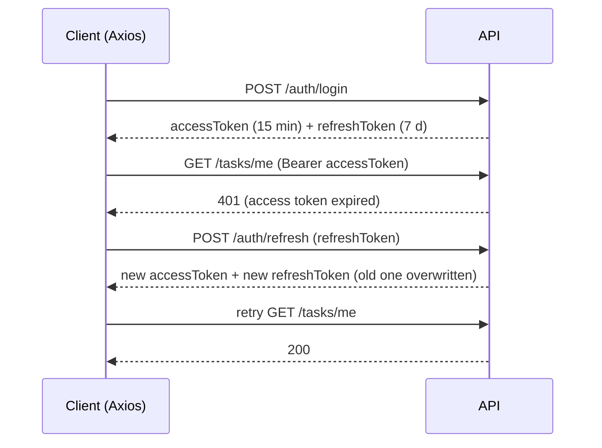
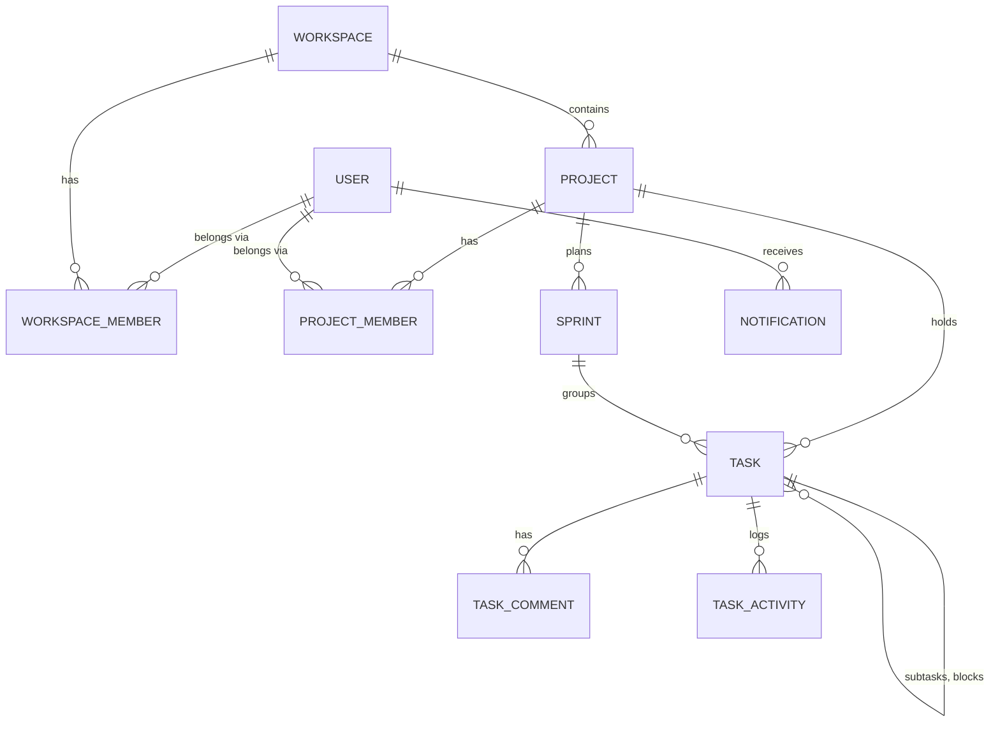
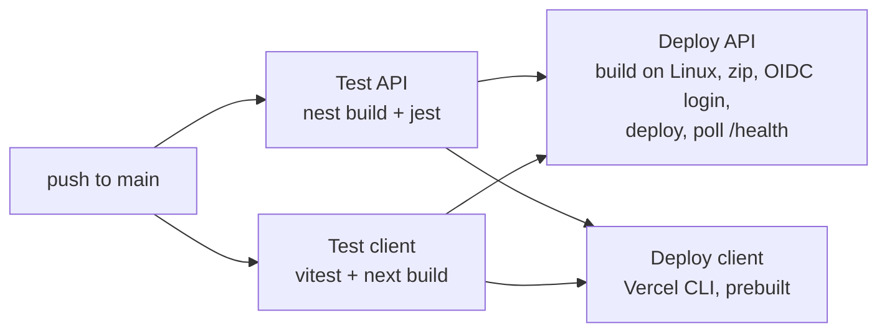

# WorkCentral — Workspace Management System

A full-stack project and task management platform in the style of Jira / Trello: workspaces, projects, sprints, a drag-and-drop Kanban board, calendar and table views, comments, attachments, task dependencies, real-time updates, global search and analytics.

Built as a final-year project by **Sachintha Chamindu**.

| | URL |
|---|---|
| Frontend (Vercel) | https://work-central.vercel.app |
| API (Azure App Service, F1 free tier) | https://wms-api-sachintha.azurewebsites.net |
| API health check | https://wms-api-sachintha.azurewebsites.net/health |
| Source | https://github.com/sachinthacham/WorkCentral |

> **Cold starts:** the API runs on the Azure App Service **Free (F1)** tier, which has no *Always On*. After ~20 minutes idle the first request can take 30–60 seconds. See [Interview / demo-day checklist](#interview--demo-day-checklist).

---

## Table of contents

1. [Screenshots](#screenshots)
2. [Features](#features)
3. [Tech stack](#tech-stack)
4. [Architecture](#architecture)
5. [Folder structure](#folder-structure)
6. [Run locally](#run-locally)
7. [Deploy to Azure (API) and Vercel (frontend)](#deploy-to-azure-api-and-vercel-frontend)
8. [CI/CD pipeline](#cicd-pipeline)
9. [API reference](#api-reference)
10. [Environment variables](#environment-variables)
11. [Testing](#testing)
12. [Known limitations](#known-limitations)

---

## Screenshots

All screenshots use the seeded demo data. They live in [client/public/screenshots](client/public/screenshots).

### Landing and sign-in

<table>
  <tr>
    <td width="50%"><br><sub><b>Landing page</b> — “Clarity for every project you ship”, with Start free and Sign in.</sub></td>
    <td width="50%"><br><sub><b>Sign in</b> — email and password, forgot-password link, “remember email on this device”.</sub></td>
  </tr>
</table>

### Workspace overview

<table>
  <tr>
    <td width="50%"><br><sub><b>Dashboard</b> — project/task totals, in-progress and completed counts, workspace snapshot, per-project task load and next deadlines.</sub></td>
    <td width="50%"><br><sub><b>Projects</b> — all projects in the workspace as cards.</sub></td>
  </tr>
  <tr>
    <td width="50%"><br><sub><b>My Tasks</b> — everything assigned to you, filterable by status with live counts.</sub></td>
    <td width="50%"><br><sub><b>Analytics</b> — status bar chart, priority donut and completion progress across all projects.</sub></td>
  </tr>
</table>

### Inside a project

<table>
  <tr>
    <td width="50%"><br><sub><b>Calendar view</b> — tasks laid out by due date.</sub></td>
    <td width="50%"><br><sub><b>Table view</b> — status, priority, due date and checklist progress, with inline status changes.</sub></td>
  </tr>
</table>

The same project page also has a **Board** (Kanban) view and a **Sprints** page; both are described under [Features](#features).

### Workspace management

<table>
  <tr>
    <td width="50%"><br><sub><b>Team members</b> — workspace roster with Owner / Admin / Member / Guest roles and an invite button.</sub></td>
    <td width="50%"><br><sub><b>Workspace settings</b> — name, description, default task priority, invitation permission and notification preferences.</sub></td>
  </tr>
  <tr>
    <td width="50%"><br><sub><b>Create workspace</b> — onboarding form for a new shared workspace.</sub></td>
    <td width="50%"></td>
  </tr>
</table>

---

## Features

**Accounts and access**
- Register, sign in and sign out with JWT authentication. Short-lived **access tokens (15 min)** plus **rotating refresh tokens (7 days)**; the client refreshes silently on a `401` and retries the request.
- Forgot-password and reset-password flow using a time-limited emailed link.
- Passwords hashed with bcrypt.

**Workspaces and roles**
- Create multiple workspaces and switch between them from the sidebar.
- Invite existing users by email with a workspace role: **Owner, Admin, Member, Guest**.
- Per-project roles: **Manager, Member, Viewer**. Managers (and workspace Owners/Admins) manage the project roster.

**Projects and sprints**
- Create projects, browse them as cards, and manage project members.
- Sprints per project with a **Planned → Active → Closed** lifecycle.

**Tasks**
- Create, edit, assign and delete tasks with status (`todo` / `in_progress` / `done`), priority (`low` / `medium` / `high`), labels, due date and cover colour.
- **Checklists** with progress bars.
- **Subtasks** and **dependencies** (“blocked by” / “blocks”) with a guard that rejects circular dependency chains.
- **Comments** and a per-task **activity log**.
- **File attachments** (10 MB limit, MIME-type allowlist for images, PDFs, Office documents and similar).
- Three views of the same data: **Kanban board** (drag and drop via dnd-kit), **Calendar** and **Table**.

**Insight and awareness**
- **Dashboard** with totals, completion rate, project task load and upcoming deadlines.
- **Analytics** with Recharts bar, donut and progress charts.
- **My Tasks** page with status filters and counts.
- **Global search** (`Ctrl`/`⌘` + `K`) across tasks, projects, comments and members, backed by MongoDB text indexes.
- **Notifications** bell with mark-as-read; created when you are assigned a task or someone comments on a task you created.
- **Real-time updates**: task changes are broadcast over Socket.IO so open project boards refresh without a reload.

**Platform**
- Rate limiting (100 requests/minute/IP), Helmet security headers, request validation that rejects unknown fields, and a CORS allowlist.
- `GET /health` liveness probe that reports database connectivity.
- Automated CI/CD to Azure and Vercel (see [CI/CD pipeline](#cicd-pipeline)).

---

## Tech stack

| Layer | Technology | Used for |
|---|---|---|
| Frontend framework | **Next.js 16** (App Router, Turbopack), **React 19**, **TypeScript 5** | Pages, routing, client UI |
| Styling | **Tailwind CSS 4**, `next/font` (Outfit, DM Sans) | Design system |
| UI libraries | **lucide-react**, **@dnd-kit** (core, sortable, utilities), **Recharts 3**, **date-fns** | Icons, Kanban drag and drop, charts, dates |
| Client networking | **Axios** (with refresh-token interceptor), **socket.io-client** | REST calls, real-time updates |
| Backend framework | **NestJS 11** on **Node.js 22**, **TypeScript** | REST API and WebSocket gateway |
| Database | **MongoDB** via **Mongoose 9** (Atlas M0 in production) | Persistence, text indexes for search |
| Auth | **Passport** + **passport-jwt**, **@nestjs/jwt**, **bcrypt** | Authentication |
| Validation and security | **class-validator**, **class-transformer**, **Helmet**, **@nestjs/throttler** | Input validation, headers, rate limiting |
| Real time | **Socket.IO 4** (`@nestjs/websockets`, `platform-socket.io`) | Task update broadcasts |
| Files and email | **Multer**, **Nodemailer** | Attachments, password-reset and invitation emails |
| Testing | **Jest** + ts-jest (API), **Vitest** + Testing Library + jsdom (client) | Unit and component tests |
| Hosting | **Azure App Service (Linux, F1)** for the API, **Vercel** for the frontend, **MongoDB Atlas** for data | Production |
| CI/CD | **GitHub Actions**, **Azure OIDC federated login**, **Vercel CLI** | Test, build and deploy |

---

## Architecture

### System overview



The browser talks to the API **directly** at `NEXT_PUBLIC_API_URL`; Vercel only serves the frontend. That is why the API needs a CORS allowlist containing the Vercel domain.

### Backend design

The API is a modular NestJS monolith. Each module owns its controller, service, DTOs and Mongoose schemas:

| Module | Responsibility |
|---|---|
| `auth` | Register, login, refresh, logout, forgot/reset password, JWT strategy |
| `users` | User lookup and refresh-token storage |
| `workspace` | Workspaces, members, invitations, settings |
| `projects` | Projects and project-level members/roles |
| `sprints` | Sprint creation and status changes |
| `tasks` | Tasks, subtasks, dependencies, comments, activity, attachments, real-time gateway |
| `notifications` | Per-user notifications |
| `dashboard` | Aggregated analytics |
| `search` | Text search across tasks, projects, comments, members |
| `email` | SMTP delivery via Nodemailer |
| `health` | Liveness probe |

**Request pipeline:** `ThrottlerGuard` (global) → `JwtAuthGuard` → optional `RolesGuard` / `ProjectRolesGuard` → `ValidationPipe` (whitelist, transform, reject unknown fields) → controller → service → Mongoose.

**Workspace context:** endpoints that are workspace-scoped read the active workspace from a `workspaceid` request header, which the client sends from `localStorage`.

### Authentication flow



If the refresh fails, the client clears its tokens and redirects to `/login`.

### Role model

| Scope | Role | What it grants |
|---|---|---|
| Workspace | `OWNER`, `ADMIN` | Invite users (`POST /workspace/invite`), edit settings (`PATCH /workspace/settings`), and bypass project-role checks in that workspace |
| Workspace | `MEMBER`, `GUEST` | All ordinary authenticated routes; no workspace admin routes |
| Project | `MANAGER` | Add, remove and change roles of project members |
| Project | `MEMBER`, `VIEWER` | Read the project roster |

See [Known limitations](#known-limitations) for what is and is not enforced.

### Data model



MongoDB collections: `users`, `workspaces`, `workspacemembers`, `projects`, `projectmembers`, `sprints`, `tasks`, `taskcomments`, `taskactivities`, `notifications`. Text indexes exist on `tasks` (title, description), `projects` (name, description) and `taskcomments` (content).

### Real-time updates

`TaskGateway` (Socket.IO) emits a `taskUpdated` event whenever a task is updated. The project page subscribes to it and refreshes its task list. The gateway uses its own CORS setting, read from the same `CORS_ORIGINS` variable as the REST API.

---

## Folder structure

```text
workspace-management-system/
├── api/                              NestJS backend
│   ├── src/
│   │   ├── main.ts                   Bootstrap: Helmet, CORS, validation, static uploads
│   │   ├── app.module.ts             Root module, global rate limiting
│   │   ├── seed.ts                   Demo-data seeder (npm run seed)
│   │   ├── config/                   database.config.ts
│   │   ├── common/
│   │   │   ├── decorators/           @Roles, @ProjectRoles
│   │   │   ├── guards/               JwtAuthGuard, RolesGuard, ProjectRolesGuard
│   │   │   ├── dto/                  Pagination DTO
│   │   │   └── helpers/              Paginated-result and uploads-path helpers
│   │   └── modules/
│   │       ├── auth/                 Login, refresh, password reset, JWT strategy
│   │       ├── users/
│   │       ├── workspace/
│   │       ├── projects/
│   │       ├── sprints/
│   │       ├── tasks/                Tasks, comments, activity, dependencies, gateway
│   │       ├── notifications/
│   │       ├── dashboard/
│   │       ├── search/
│   │       ├── email/
│   │       └── health/
│   ├── test/                         e2e scaffold
│   └── .env.example
│
├── client/                           Next.js frontend
│   ├── app/                          App Router pages
│   │   ├── page.tsx                  Landing page
│   │   ├── login/  register/  forgot-password/  reset-password/
│   │   ├── dashboard/                Overview, my-tasks/, analytics/
│   │   ├── projects/                 List, [projectId]/ board+calendar+table, sprints/
│   │   └── workspace/                create/, members/, settings/
│   ├── components/                   KanbanBoard, TaskDetailModal, CalendarView, TableView,
│   │   └── ui/                       SearchModal, Sidebar, NotificationBell, … + Button, Modal, Badge
│   ├── features/                     One api.ts per domain (auth, tasks, projects, sprints, …)
│   ├── services/                     api.ts (Axios + refresh), socket.ts, config.ts (API base URL)
│   ├── types/                        Shared TypeScript types
│   ├── public/screenshots/           README screenshots
│   └── .env.example
│
├── .github/workflows/
│   ├── ci-cd.yml                     Test → deploy API to Azure, deploy client to Vercel
│   ├── keep-warm.yml                 Pings /health so the F1 app stays loaded
│   └── seed-database.yml             Manual, confirmation-gated database reset
│
├── DEPLOYMENT.md                     Detailed deployment runbook and gotchas
└── README.md
```

---

## Run locally

### 1. Prerequisites

| Tool | Version | Link |
|---|---|---|
| Node.js | 22 LTS (20.9+ works for the client) | https://nodejs.org/en/download |
| Git | any recent | https://git-scm.com/downloads |
| MongoDB | 7 or newer — pick **one** option below | |

MongoDB options:
- **MongoDB Community Server** installed locally: https://www.mongodb.com/try/download/community
- **Docker**: `docker run -d --name mongo -p 27017:27017 mongo:7` (Docker Desktop: https://www.docker.com/products/docker-desktop/)
- **MongoDB Atlas** free cluster (then use its connection string as `MONGO_URI`): https://www.mongodb.com/cloud/atlas/register

### 2. Clone

```bash
git clone https://github.com/sachinthacham/WorkCentral.git
cd WorkCentral
```

### 3. Start the API (port 3000)

```bash
cd api
npm install
cp .env.example .env        # works in bash and PowerShell
```

Edit `api/.env`. For local development the defaults are fine except `JWT_SECRET`, which you should set to any long random string:

```env
MONGO_URI=mongodb://localhost:27017/saas-platform
JWT_SECRET=any-long-random-string
PORT=3000
CORS_ORIGINS=http://localhost:3001
APP_URL=http://localhost:3001
```

Load the demo data, then start the server:

```bash
npm run seed          # WARNING: empties every collection in the target database first
npm run start:dev     # watch mode
```

Check it is healthy: http://localhost:3000/health should return `{"status":"ok","database":"connected",…}`.

### 4. Start the client (port 3001)

In a second terminal:

```bash
cd client
npm install
npm run dev
```

`NEXT_PUBLIC_API_URL` defaults to `http://localhost:3000`, so no client env file is needed. To point at a different API, copy `client/.env.example` to `client/.env.local` and edit it.

### 5. Open the app and sign in

| What | Where |
|---|---|
| **Web app** | http://localhost:3001 |
| **API** | http://localhost:3000 |
| **API health** | http://localhost:3000/health |
| **MongoDB** | `mongodb://localhost:27017/saas-platform` |

**Demo login (created by `npm run seed`):**

| Field | Value |
|---|---|
| Email | `sachinthachamindu26@gmail.com` |
| Password | `12345678` |

This one account owns all the seeded data: 1 workspace ("Capstone Workspace"), 6 projects, 18 sprints and about 86 tasks with comments, activity and notifications. The seed also creates three placeholder members (`placeholder.member1@internal.local` … `member3`) that only appear in the Members list — they cannot be used to sign in. You can also create your own account from the **Create an account** link on the sign-in page.

### Common local problems

| Symptom | Fix |
|---|---|
| Port 3001 is already in use | Run the client on another port, e.g. `npx next dev -p 3002`, and add that origin to the API: set `CORS_ORIGINS=http://localhost:3002` in `api/.env` and restart the API. Otherwise the browser blocks requests with a CORS error. |
| API exits with a Mongo connection error | MongoDB is not running or `MONGO_URI` is wrong. |
| Login works but pages show no data | You skipped `npm run seed`, or the client is pointing at a different API than you expect. |
| `npm ci` fails with `Cannot read properties of null (reading 'edgesOut')` | Old npm bug. Run `npm install -g npm@latest`, or use `npm install` instead of `npm ci`. |
| Password-reset or invitation emails never arrive | Expected locally: no SMTP server is configured, so the email step fails and is only logged. Set the `SMTP_*` variables to enable it. |

### Production build locally

```bash
cd api    && npm run build && npm run start:prod
cd client && npm run build && npm run start      # serves on port 3001
```

---

## Deploy to Azure (API) and Vercel (frontend)

### Target architecture and cost

| Piece | Service | Tier | Monthly cost |
|---|---|---|---|
| API | Azure App Service, Linux, Node 22 | **F1 (Free)** | $0 |
| Database | MongoDB Atlas | **M0 (free, 512 MB)** | $0 |
| Frontend | Vercel | Hobby | $0 |
| CI/CD | GitHub Actions | free minutes | $0 |

The API is deployed as a **code package** (zip) to Azure's built-in Node runtime, not as a custom Docker image — the F1 tier does not support custom containers.

**Why Atlas and not Cosmos DB?** Search relies on MongoDB `$text` indexes, which Azure Cosmos DB for MongoDB does not support.

### What you need first

- An Azure subscription ([Azure for Students](https://azure.microsoft.com/free/students/) works), the [Azure CLI](https://learn.microsoft.com/cli/azure/install-azure-cli), and the [GitHub CLI](https://cli.github.com/)
- A [MongoDB Atlas](https://www.mongodb.com/cloud/atlas/register) account and a [Vercel](https://vercel.com/signup) account
- The repository on GitHub

Commands below are for bash (Git Bash, WSL, or [Azure Cloud Shell](https://shell.azure.com)). Replace every `<placeholder>`.

### Step 1 — MongoDB Atlas

1. Create a free **M0** cluster at https://cloud.mongodb.com.
2. **Database Access** → add a database user and save the password.
3. **Network Access** → add `0.0.0.0/0`. F1 has no fixed outbound IP, so IP allow-listing to the app is not possible.
4. **Connect → Drivers** → copy the `mongodb+srv://…` string and put the database name before the `?`:

   ```text
   mongodb+srv://<user>:<password>@<cluster>.mongodb.net/saas-platform?retryWrites=true&w=majority
   ```

### Step 2 — Create the Azure resources

```bash
az login
az account set --subscription "<subscription-id>"

RG=rg-workspace-mgmt
LOCATION=eastasia                 # pick a region your subscription allows (see note below)
PLAN=asp-workspace-f1
APP=<globally-unique-app-name>    # becomes https://<APP>.azurewebsites.net

az group create -n $RG -l $LOCATION
az appservice plan create -n $PLAN -g $RG -l $LOCATION --is-linux --sku F1
az webapp create -n $APP -g $RG -p $PLAN --runtime "NODE:22-lts"

# Startup command, WebSockets for Socket.IO, HTTPS only. F1 cannot enable Always On.
az webapp config set -n $APP -g $RG \
  --startup-file "node dist/main.js" --web-sockets-enabled true --always-on false
az webapp update -n $APP -g $RG --https-only true
```

> **Region policy:** Azure for Students only allows certain regions. In the original setup `southeastasia` was rejected with `RequestDisallowedByAzure` while `eastasia` worked. If creation fails with that error, try another region.

### Step 3 — Configure the API

```bash
az webapp config appsettings set -n $APP -g $RG --settings \
  MONGO_URI="<atlas-connection-string>" \
  JWT_SECRET="$(openssl rand -base64 48)" \
  CORS_ORIGINS="https://<your-project>.vercel.app" \
  APP_URL="https://<your-project>.vercel.app" \
  UPLOADS_DIR="/home/data/uploads" \
  NODE_ENV="production" \
  SCM_DO_BUILD_DURING_DEPLOYMENT="false" \
  WEBSITES_ENABLE_APP_SERVICE_STORAGE="true"
```

You will not know the Vercel domain until Step 6; set a placeholder now and update `CORS_ORIGINS` and `APP_URL` afterwards. Do **not** set `PORT` — App Service injects it. `SCM_DO_BUILD_DURING_DEPLOYMENT=false` matters: see the [troubleshooting table](#azure-troubleshooting).

Optional: `CORS_ORIGIN_REGEX="^https://<your-project>-.*\.vercel\.app$"` also allows Vercel preview deployments.

### Step 4 — Let GitHub Actions deploy without a password (OIDC)

The pipeline signs in to Azure with a short-lived federated token; no publish profile or password is stored in GitHub.

```bash
SUB=$(az account show --query id -o tsv)
TENANT=$(az account show --query tenantId -o tsv)

APP_ID=$(az ad app create --display-name gh-deploy-workspace-mgmt --query appId -o tsv)
az ad sp create --id $APP_ID
SP_ID=$(az ad sp show --id $APP_ID --query id -o tsv)

# Least privilege: Contributor on this resource group only
az role assignment create --role Contributor \
  --assignee-object-id $SP_ID --assignee-principal-type ServicePrincipal \
  --scope /subscriptions/$SUB/resourceGroups/$RG
```

Trust workflow runs from your repository's `production` environment. Save this as `cred.json` (replace owner and repo):

```json
{
  "name": "gh-env-production",
  "issuer": "https://token.actions.githubusercontent.com",
  "subject": "repo:<github-owner>/<repo>:environment:production",
  "audiences": ["api://AzureADTokenExchange"]
}
```

```bash
az ad app federated-credential create --id $APP_ID --parameters @cred.json
```

Using a file avoids JSON-quoting problems in PowerShell.

### Step 5 — GitHub secrets, variables and environment

```bash
gh secret set AZURE_CLIENT_ID       --body "$APP_ID"
gh secret set AZURE_TENANT_ID       --body "$TENANT"
gh secret set AZURE_SUBSCRIPTION_ID --body "$SUB"
gh secret set MONGO_URI             --body "<atlas-connection-string>"   # only used by the seed workflow
gh variable set NEXT_PUBLIC_API_URL --body "https://$APP.azurewebsites.net"
gh api -X PUT repos/<github-owner>/<repo>/environments/production
```

Then edit the app name in the workflows so they point at *your* app: `AZURE_WEBAPP_NAME` and the `environment.url` in [.github/workflows/ci-cd.yml](.github/workflows/ci-cd.yml), and the URL in [.github/workflows/keep-warm.yml](.github/workflows/keep-warm.yml).

### Step 6 — Vercel frontend

1. Go to https://vercel.com/new and import the GitHub repository.
2. Set **Root Directory** to `client` (the repository root is not a Next.js app).
3. Add the environment variable `NEXT_PUBLIC_API_URL` = `https://<APP>.azurewebsites.net`. It is inlined at build time, so changing it later needs a redeploy.
4. Deploy, then copy the resulting `https://<project>.vercel.app` domain and update the Azure settings from Step 3:

   ```bash
   az webapp config appsettings set -n $APP -g $RG --settings \
     CORS_ORIGINS="https://<project>.vercel.app" APP_URL="https://<project>.vercel.app"
   ```

To let the **pipeline** deploy the frontend (so failing tests block a release), also add:

| Secret | Where to find it |
|---|---|
| `VERCEL_TOKEN` | https://vercel.com/account/tokens |
| `VERCEL_PROJECT_ID` | Project → Settings → General → *Project ID* |
| `VERCEL_ORG_ID` | Project/Team Settings → General → *Team ID* (or account *Your ID*) |

```bash
gh secret set VERCEL_TOKEN --body "<token>"
gh secret set VERCEL_PROJECT_ID --body "<project-id>"
gh secret set VERCEL_ORG_ID --body "<team-or-user-id>"
```

If you want only the pipeline to deploy, turn off Vercel's automatic Git deployments for the project (Project → Settings → Git). Otherwise Vercel deploys on every push independently of the tests.

### Step 7 — Deploy

Push to `main` (or run the workflow manually from the Actions tab). The pipeline tests both apps, builds the API on Linux, deploys it to Azure, then polls `/health`. Watch it at `https://github.com/<github-owner>/<repo>/actions`.

### Step 8 — Load demo data

Either run the **Seed database** workflow (Actions tab → *Run workflow* → type `WIPE AND SEED`), or from your machine:

```bash
cd api
MONGO_URI="<atlas-connection-string>" npm run seed
```

The seed **deletes all existing data** in that database first.

### Step 9 — Verify

```bash
curl https://<APP>.azurewebsites.net/health
# {"status":"ok","database":"connected","uptimeSeconds":…}
```

Open your Vercel URL and sign in with `sachinthachamindu26@gmail.com` / `12345678`.

### Interview / demo-day checklist

About 15 minutes beforehand:

1. GitHub → **Actions** → **Keep API warm** → **Run workflow**, and wait for the green tick. (The scheduled runs are unreliable; a manual run guarantees a warm app.)
2. Open `https://<APP>.azurewebsites.net/health` and confirm `"database":"connected"`.
3. Open the frontend, sign in, and click through the dashboard once.
4. Optional: run **Seed database** for a clean dataset.
5. Do not load-test the API that day (see the quota row below).

### Azure troubleshooting

| Symptom | Cause and fix |
|---|---|
| Every request returns **403 "Site Disabled"** or **503**, and deploys fail with `Site Disabled (CODE: 403)` | The F1 daily **60 CPU-minute quota** is used up. Check with `az webapp show -n $APP -g $RG --query "{state:state,usage:usageState}" -o tsv` — `QuotaExceeded` means blocked. It resets at **00:00 UTC** and nothing else clears it (restarting or moving the app to another plan does not). |
| A server-side (Oryx) build fails with "Errors (0)" then "Deployment Failed", and burns the quota | F1's 1 GB disk cannot hold a full `npm install`. Keep `SCM_DO_BUILD_DURING_DEPLOYMENT=false`; the pipeline ships a prebuilt package. |
| First request after a while takes 30–60 s | Cold start; F1 has no Always On. The `keep-warm.yml` workflow helps but GitHub's cron can lag. |
| `AADSTS700213: No matching federated identity record` | The token's subject differs from your credential. Some GitHub accounts issue an *immutable* subject such as `repo:<owner>@<id>/<repo>@<id>:environment:production`. Add a federated credential with exactly the subject printed in the error. Add one for the repository's old name too if it was renamed. |
| `az role assignment create` fails with `MissingSubscription` | Seen on Azure CLI 2.90. Use the portal instead: resource group → **Access control (IAM)** → **Add role assignment** → **Contributor** → select the app registration. |
| Publish-profile deployment does not work | Basic publishing credentials are disabled by default. The pipeline uses OIDC instead. |
| Client job fails at `npm ci` with a `picomatch` "does not satisfy" error | The npm bundled with Node 22 (10.9.x) has a resolver bug on this dependency tree. The workflow runs `npm install -g npm@latest` first. |
| WebSocket connections are refused | F1 allows only about 5 concurrent WebSocket connections, and Web Sockets must be enabled on the app (Step 2). |

More detail and history: [DEPLOYMENT.md](DEPLOYMENT.md).

---

## CI/CD pipeline

`.github/workflows/ci-cd.yml` runs on every push to `main` (pull requests run tests only).



- **Tests gate deployment:** both deploy jobs need both test jobs to pass.
- **Why the API is built in CI:** `bcrypt` is a native module, so `node_modules` must be built on Linux to match App Service, and F1 is too small to build on the instance. CI compiles TypeScript, reinstalls production dependencies only, zips `dist` + `node_modules`, and deploys that.
- **No stored Azure credentials:** the job uses `azure/login` with an OIDC federated credential scoped to one resource group.
- **Post-deploy verification:** the job polls `/health` for up to ~5 minutes and warns if the database is not connected.

Other workflows:

| Workflow | Trigger | Purpose |
|---|---|---|
| `keep-warm.yml` | every 10 minutes, or manually | Pings `/health` to reduce F1 cold starts |
| `seed-database.yml` | manual only; you must type `WIPE AND SEED` | Resets the database to the demo dataset |

---

## API reference

Base URL: `http://localhost:3000` locally, `https://<APP>.azurewebsites.net` in production.

- Send `Authorization: Bearer <accessToken>` on every protected route.
- Workspace-scoped routes also expect a `workspaceid` header.
- List endpoints accept `page` and `limit` query parameters.

| Area | Method and path | Access | Description |
|---|---|---|---|
| Health | `GET /health` | public | Liveness plus database status |
| Auth | `POST /auth/register` | public | Create an account |
| | `POST /auth/login` | public | Returns access and refresh tokens |
| | `POST /auth/refresh` | public | Rotate the token pair |
| | `POST /auth/forgot-password`, `POST /auth/reset-password` | public | Emailed reset link flow |
| | `POST /auth/logout`, `GET /auth/profile` | JWT | Sign out, current user |
| Workspace | `POST /workspace`, `GET /workspace` | JWT | Create and list your workspaces |
| | `GET /workspace/members` | JWT | Members of the active workspace |
| | `POST /workspace/invite` | Owner/Admin | Invite an existing user by email |
| | `PATCH /workspace/settings` | Owner/Admin | Update workspace settings |
| Projects | `POST /projects`, `GET /projects` | JWT | Create and list projects |
| | `GET /projects/:projectId/my-role` | JWT | Your role in the project |
| | `GET /projects/:projectId/members` | Manager/Member/Viewer | Project roster |
| | `POST /projects/:projectId/members` | Manager | Add a member |
| | `PATCH /projects/:projectId/members/:userId/role` | Manager | Change a role |
| | `DELETE /projects/:projectId/members/:userId` | Manager | Remove a member |
| Sprints | `POST /sprints` | JWT | Create a sprint |
| | `GET /sprints/project/:projectId` | JWT | Sprints of a project |
| | `PATCH /sprints/:id/status` | JWT | Planned / Active / Closed |
| Tasks | `POST /tasks` | JWT | Create a task |
| | `GET /tasks/:projectId` | JWT | Tasks of a project (paginated, filterable) |
| | `GET /tasks/me`, `GET /tasks/me/counts` | JWT | Tasks assigned to you, and status counts |
| | `PATCH /tasks/:taskId`, `PATCH /tasks/:taskId/status`, `PATCH /tasks/:taskId/assign` | JWT | Update, change status, assign |
| | `DELETE /tasks/:taskId` | JWT | Delete |
| | `POST /tasks/:taskId/attachments` | JWT | Upload a file (`multipart/form-data`, field `file`) |
| | `POST/GET /tasks/:taskId/subtasks` | JWT | Create and list subtasks |
| | `POST/GET /tasks/:taskId/dependencies`, `DELETE /tasks/:taskId/dependencies/:blockingTaskId` | JWT | Manage “blocked by” links |
| | `POST/GET /tasks/:taskId/comments`, `GET /tasks/:taskId/activity` | JWT | Comments and activity log |
| Search | `GET /search?q=&type=&limit=` | JWT | `type` is `tasks`, `projects`, `comments` or `members`; omit it to search all |
| Dashboard | `GET /dashboard/analytics` | JWT | Totals, completion rate, deadlines |
| Notifications | `GET /notifications`, `PATCH /notifications/:id/read` | JWT | List and mark as read |
| Files | `GET /uploads/attachments/:file` | public | Uploaded attachment |
| WebSocket | Socket.IO event `taskUpdated` | — | Broadcast when a task changes |

---

## Environment variables

### API (`api/.env` locally; App Service application settings in Azure)

| Variable | Required | Default | Purpose |
|---|---|---|---|
| `MONGO_URI` | yes | — | MongoDB connection string |
| `JWT_SECRET` | yes | — | Signs access and refresh tokens |
| `PORT` | local only | `3000` | HTTP port (injected by App Service in Azure) |
| `CORS_ORIGINS` | production | `http://localhost:3001` | Comma-separated allowed browser origins (REST and Socket.IO) |
| `CORS_ORIGIN_REGEX` | no | — | Extra allowed origins by pattern, e.g. Vercel previews |
| `APP_URL` | production | `http://localhost:3001` | Frontend URL used in emailed links |
| `UPLOADS_DIR` | production | `<cwd>/uploads` | Where attachments are stored (`/home/data/uploads` on Azure survives redeploys) |
| `SMTP_HOST`, `SMTP_PORT`, `SMTP_SECURE`, `SMTP_USER`, `SMTP_PASS`, `MAIL_FROM` | no | Ethereal stub | Outgoing email |

### Client (`client/.env.local` locally; Vercel environment variables in production)

| Variable | Default | Purpose |
|---|---|---|
| `NEXT_PUBLIC_API_URL` | `http://localhost:3000` | Base URL of the API. Inlined at build time. |

---

## Testing

```bash
cd api    && npm test      # Jest: 8 suites, 37 tests
cd client && npm test      # Vitest + Testing Library: 5 files, 17 tests
```

Covered: authentication (login, refresh, forgot/reset), workspace, projects and roles, sprints (service and controller), tasks, the pagination helper, the email service, the dashboard page, task comments, and shared UI components. CI runs both suites plus a production build of each app on every push.

---

## Known limitations

- **Read-only roles are not enforced.** Workspace `GUEST` and project `VIEWER` are stored and shown, but task, sprint and comment routes only require a valid login. Only workspace admin routes and project roster management are role-guarded.
- **Real-time events are broadcast to every connected client.** `taskUpdated` is not scoped to a workspace or project, so a client can receive update events for tasks it does not belong to.
- **Invitations need an existing account.** Inviting an email that has not registered returns "No account found with that email".
- **Email needs SMTP configuration.** Without `SMTP_*` settings, password-reset and invitation emails fail silently (logged only); the invitation itself is still recorded.
- **Attachments are stored on the server's disk** (`/home/data/uploads` on Azure), not in blob storage.
- **F1 constraints:** cold starts, a 60 CPU-minute daily quota, about 5 concurrent WebSocket connections, and no custom domain with SSL.
